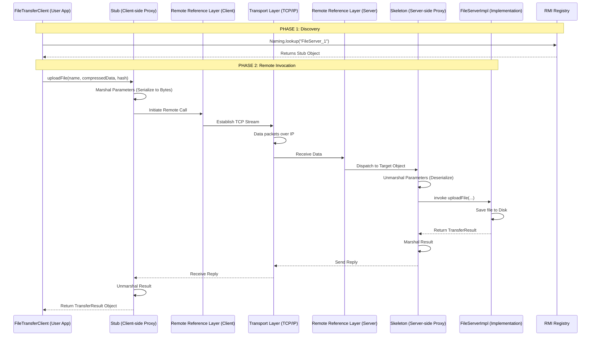

# Java RMI Architecture: File Transfer System

This document explains the internal mechanics of the Java Remote Method Invocation (RMI) architecture as implemented in this project.

## 1. Architecture Overview (Mermaid Diagram)

The following diagram illustrates how a call to `uploadFile()` travels from the `FileTransferClient` to the `FileServerImpl`.

## 2. Component Explanations

### A. The Stub (Client Proxy)
The **Stub** is a local object on the client machine that acts as a gateway to the remote server. 
- **Marshalling**: When `FileTransferClient` calls `uploadFile()`, the stub converts the arguments (including the 2MB chunk byte arrays) into a stream of bytes.
- **Translucency**: The client code interacts with the stub as if it were a local object, hiding all networking complexity.

### B. Remote Reference Layer (RRL)
The **RRL** sits between the stub/skeleton and the transport layer. It manages the specific semantics of the remote connection. For our project, it handles the "Unicast" nature of the server, ensuring that a call from a client stub is routed to the correct server instance registered in the Registry.

### C. The Transport Layer (TCP/IP)
This is the low-level layer that manages the actual socket connection between the client and server. It maps directly to the **Transport Layer** in the Fig. 01 Communication Stack. It ensures that RMI calls are delivered reliably.

### D. The Skeleton (Server Proxy)
The **Skeleton** (or the modern RMI dispatcher) is the server-side counterpart to the stub.
- **Dispatching**: It receives the incoming byte stream from the RRL and "unmarshals" it back into Java objects.
- **Execution**: It identifies which method is being called (e.g., `downloadFile`) and invokes the actual method on the `FileServerImpl` object.

### E. Server Implementation (`FileServerImpl`)
This is where the actual business logic resides. In our project, this is where the `ReplyCache` check, `fileLocks` acquisition, and `Files.write` operations occur.

### F. RMI Registry
The **Registry** (or naming service) acts as a phonebook. 
- **Registration**: On startup, `FileServerImpl` uses `Naming.rebind()` to place its stub in the registry.
- **Lookup**: The `FileTransferClient` (via the `LoadBalancer`) uses `Naming.lookup()` to fetch the stub required to communicate with the server.

## 3. Serialization in this Project
Serialization is critical for our **Chunked Upload Strategy**. When we send a `byte[]` chunk, Java RMI uses **Object Serialization** to encode the array into a byte stream. Because we also use custom DTOs like `TransferResult` and `ServerDiagnostics`, all these classes must implement `java.io.Serializable` so the Stub and Skeleton can successfully marshal and unmarshal them during the communication lifecycle.
