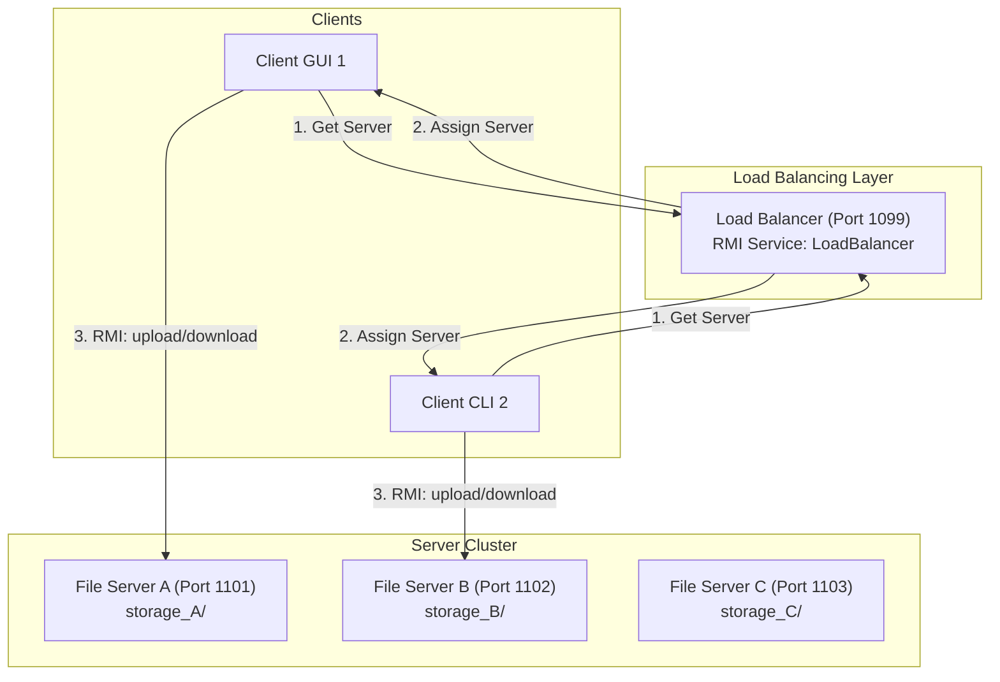

# Distributed File Transfer System — Project Documentation

## 1. Executive Summary

The **Distributed File Transfer System** is a Java RMI-based application designed to facilitate high-performance, fault-tolerant file sharing across multiple servers. Unlike a simple client-server setup, this system implements a central **Load Balancer** for server discovery, **automatic failover** for high availability, and **concurrency protection** to ensure data integrity in a distributed environment.

### 4. Advanced Benchmarking (Performance Analysis)
The system includes a side-by-side performance analyzer that measures upload latency across 4 different architectures:
- **Java RMI (Native)**: Uses standard Java object serialization and the `uploadChunk` remote method.
- **Raw Socket RPC**: Minimal TCP overhead with binary serialization.
- **Pseudo-gRPC (HTTP/2)**: Simulates modern web service overhead (POST requests).
- **Legacy CORBA**: Simulates legacy systems with artificial marshaling delays (5-10ms per chunk).

**Granular Reporting**:
- For every file selected, the system splits it into **64KB chunks**.
- It reports the **individual latency** of every chunk in real-time.
- This allows students to see how protocol overhead accumulates over large transfers.

---

## 2. System Architecture

The architecture follows a three-tier model:

1.  **Load Balancer (Registry)**: Acts as the entry point, maintaining a list of active servers and distributing clients.
2.  **File Servers**: Hold the physical data, maintain metadata, and provide RMI services.
3.  **Clients (CLI/GUI)**: Interact with the distributed system through remote method calls.

### 2.1. Architectural Diagram

---

## 3. Distributed Computing (RMI) Concepts Alignment

This project is mapped directly to core Distributed Computing curriculum topics:

### A. Remote Method Invocation (RMI)

- **Service Definition**: Defined via `FileTransferService` (extending `Remote`).
- **Remote Objects**: `FileServerImpl` is the remote object exported via `UnicastRemoteObject`.
- **RMI Registry**: Managed dynamically by each server to bind its service (`FileTransferService_ServerName`).

### B. Transparency & Load Balancing

- **Location Transparency**: The client doesn't need to know the specific IP/Port of the target server ahead of time; it asks the Load Balancer.
- **Round-Robin Assignment**: The Load Balancer ensures even traffic distribution across the cluster.

### C. Parameter Marshaling and Serialization

- **Data Transfer Objects (DTOs)**: `FileMetadata` and `TransferResult` implement `Serializable` to be passed over the network.
- **Compression**: GZIP compression is applied before data is "marshaled" (sent over the wire) to reduce network overhead.

### D. Fault Tolerance & Failover

- **Health Monitoring**: The Client catches `RemoteException` during calls.
- **Dynamic Recovery**: Upon failure, the client transparently re-queries the Load Balancer and switches to a healthy server without user intervention.

### E. Distributed Concurrency Control

- **Mutual Exclusion**: Implemented using a `Map` of `ReentrantLock` objects on the server. This ensures that concurrent "Writes" (uploads) to the same resource (filename) are handled sequentially, satisfying strict consistency requirements.

---

## 4. Key Performance Features

| Feature | Implementation Detail | Benefit |
| :--- | :--- | :--- |
| **GZIP Compression** | `compress()` / `decompress()` | Faster transfers, lower bandwidth cost. |
| **LRU Cache** | `ReplyCache` (LinkedHashMap) | Instant responses for redundant metadata/list queries. |
| **SHA-256 Integrity** | MessageDigest | Ensures files aren't corrupted during transmission. |
| **Async Polling** | SwingWorker / Threads | Keeps UI responsive during long-running network I/O. |

---

## 5. Implementation Workflow Guide

1.  **Define Interface**: `FileTransferService.java` defines the contract.
2.  **Skeleton Implementation**: `FileServerImpl.java` handles storage, locks, and logs.
3.  **Registry Setup**: `LoadBalancer.java` provides the lookup service.
4.  **Client Development**: `FileTransferUI.java` provides the event-driven dashboard.
5.  **Deployment**: Polyglot scripts (`.sh` / `.bat`) enable cross-platform execution.

---

## 6. Conceptual FAQ

### Q1: Is RMI synchronous? How does the Load Balancer handle many clients?

**Answer**: Yes, RMI calls are synchronous (blocking). However, the RMI Runtime environment is inherently multi-threaded. When a client calls `getServer()`, the Load Balancer spawns a worker thread to handle that specific request. This allows the Load Balancer to handle concurrent requests from different clients even though each individual client is "waiting."

### Q2: Why is the Load Balancer a "Broker" and not a "Proxy"?

**Answer**: In this architecture, the Load Balancer acts as a **Discovery Service**. If it acted as a proxy (passing all file data through itself), it would become a massive bottleneck. By just returning the "next best" server address, it allows the actual high-bandwidth file transfer to happen directly between the client and the file server.

---

## 7. Conclusion

This project demonstrates a comprehensive implementation of the **Distributed Computing** paradigm. By combining RMI for network transparency with advanced features like failover and caching, it represents a production-grade approach to distributed file management.
